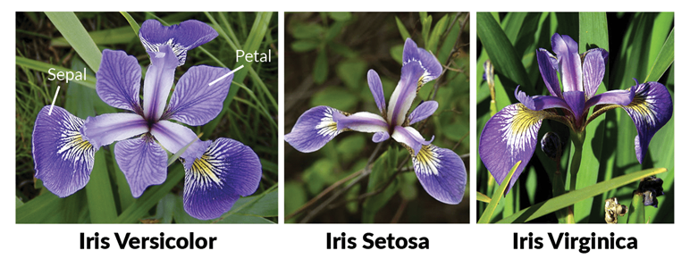
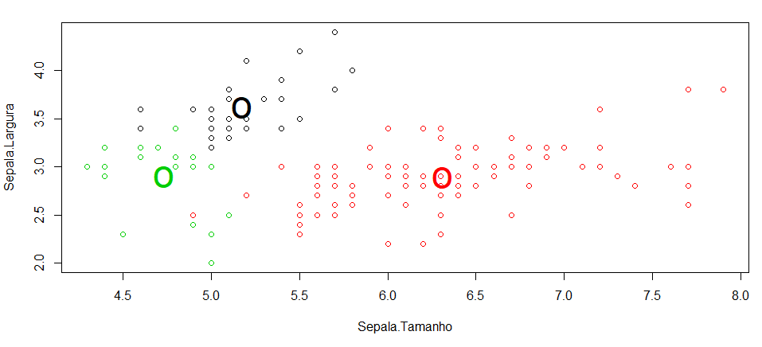
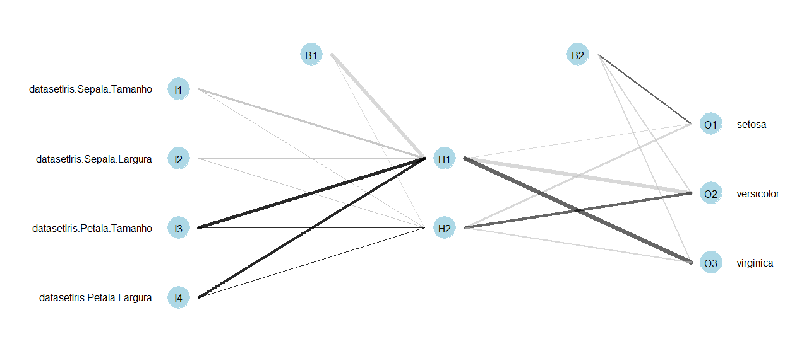
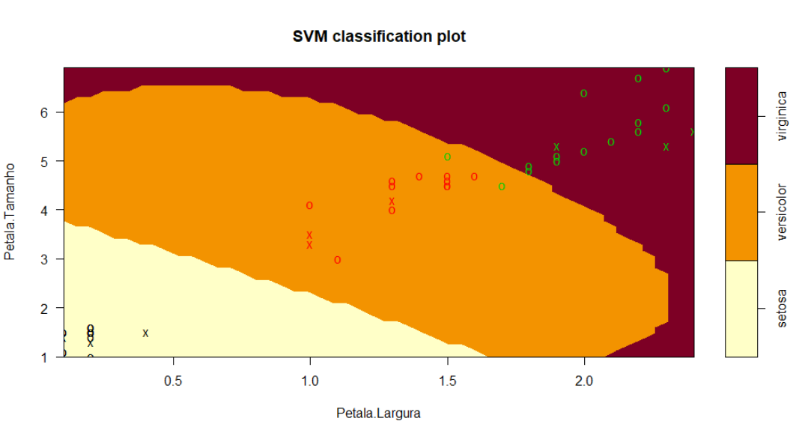

# Demonstration 1.
This demonstration was held in the [Nerdzão Portugal #13 LIVE](https://www.youtube.com/watch?v=ZXRnLtRPtIg) to show an introduction to Machine Learning. 

## Dataset
To perform the demonstration, I used the dataset Iris (https://archive.ics.uci.edu/ml/datasets/iris): 

# Algorithms and Results
It used the **k-means** algorithm to demonstrate the concept of Machine Learning Unsupervised. 

The results: 

To demonstrate the concepts of Supervised Machine Learning algorithms, I used a **Neural Network** and **SVM** (_Support Vector Machines_). And the results were: 

**Neural Network**: 

**SVM**:

