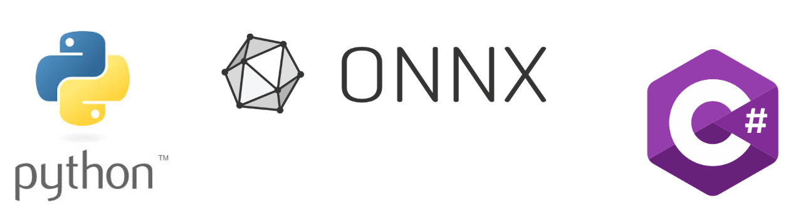
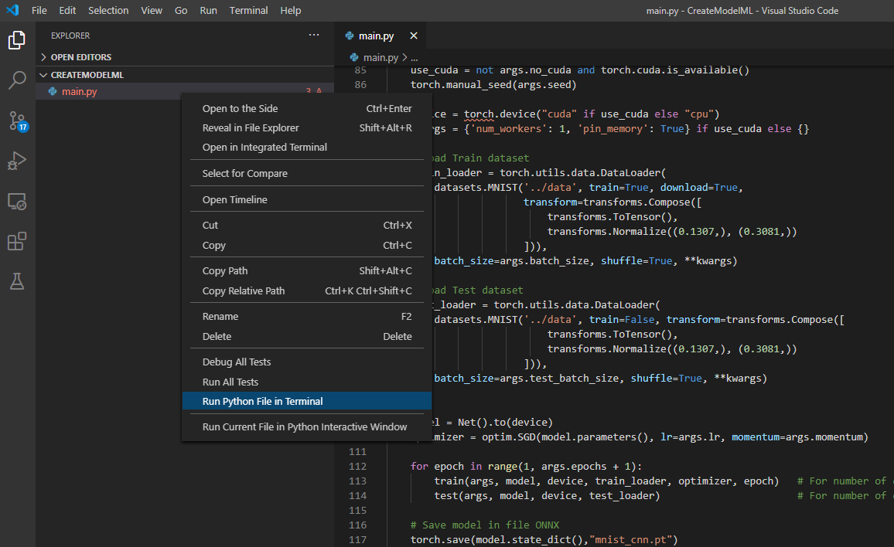

# Demonstration 2
This demonstration was held in the [Nerdzão Portugal #14 LIVE](https://www.youtube.com/) to show an introduction to Machine Learning. 



In this project uses [PyTorch](https://pytorch.org/) (package in Python) to create an ONNX model used to recognize number digits (0 to 9). It also contains a WinForms project to consume the model.


## Run this demo

To run this demo you need to configure python and install:
* Anaconda Navigator;

After, you will need to open an Anaconda prompt via `Start | Anaconda3 | Anaconda Prompt`. 

To install PyTorch via Anaconda use the following conda command:

``` powershell
conda install pytorch-cpu torchvision-cpu -c pytorch
``` 

In this [link](https://pytorch.org/get-started/locally/), you can see more.

So, with Visual Studio Code, you run project python: 



So the code in python will run and after a few minutes the `mnist_cnn.onnx` file will be generated.


Now, open the `Demo2.sln` project in .Net and run this application. As soon as you run the application, the following screen will appear. 


Click the "Load Model" button and select the `mnist_cnn.onnx` file created by python.

The model will be loaded. So, just draw and see how much the model will hit.

### Shortcut
If you want to run the model without running the code in Python, the template I trained is in the [ModelOfDemo](https://github.com/MackMendes/Nerdzao-MachineLearning-AnIntroductionForDeveloper) folder.