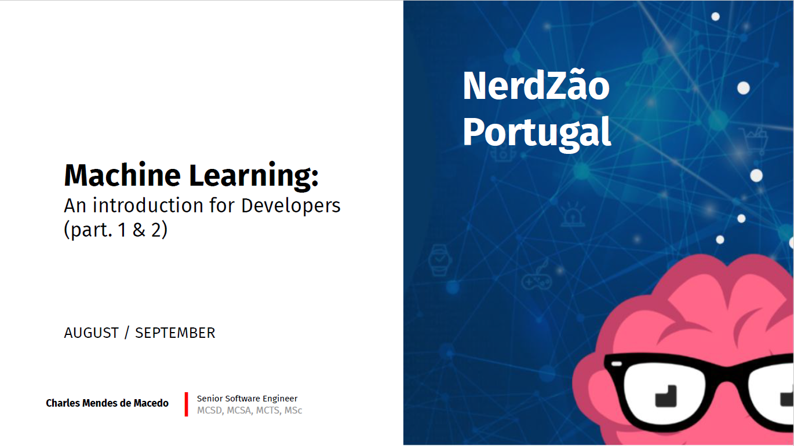

# Machine Learning: an introduction for Developers - Nerdzão Portugal.
In this repository you have the two demonstrations I made in the Nerdzão Portugal [#13 LIVE](https://www.youtube.com/watch?v=ZXRnLtRPtIg) and [#14 LIVE](https://www.youtube.com/) to show an introduction to Machine Learning. 

The items I presented were:
1. What is Machine Learning?
    * History
    * Why only in recent years? 
    * Objectives 
2. Main types of machine learning algorithms & Technologies
3. Demonstration 1
4. Metrics
6. Consuming Models
5. Black-box
7. Demonstration 2
8. Starting the study

This representation is available in the [presentation](https://github.com/MackMendes/Nerdzao-MachineLearning-AnIntroductionForDeveloper/presentation) folder within this repository.

I made two demonstrations to:
* show the difference in practice between supervised and unsupervised Machine Learning;
* show ONNX technology in practice;

The demonstrations are:

## Demo 1
To perform the demonstration, I used the dataset Iris (https://archive.ics.uci.edu/ml/datasets/iris) with the language R: 

More details in [Demo1](https://github.com/MackMendes/Nerdzao-MachineLearning-AnIntroductionForDeveloper/Demo1) folder in this repository.

## Demo 2
In this demo, I show the ONNX technology in action: a statistical model was created in Python and this model will be used in C# to make a prediction of a number drawn:

More defails in [Demo2](https://github.com/MackMendes/Nerdzao-MachineLearning-AnIntroductionForDeveloper/Demo2) folder in this repository.

## Courses
* [Coursera: Machine Learning, by Andrew Ng](https://www.coursera.org/learn/machine-learning)
* [Coursera: Data Science](https://pt.coursera.org/specializations/jhu-data-science)
* [EDX: Data, Analytics and Learning](https://www.edx.org/course/data-analyticslearning-utarlingtonx-link5-10x)
* [Udemy: Data Science A-Z™: Real-Life Data Science Exercises Included](https://www.udemy.com/datascience/)
* [Udemy: Machine Learning A-Z - Python & R in Data Science Course](https://www.udemy.com/machinelearning/)
* [Udemy: Complete Google Cloud Data Engineer & Architect Course (GCP)](https://www.udemy.com/gcp-data-engineer-and-cloud-architect)
* [Udacity: Intro to Machine Learning;](https://eu.udacity.com/course/intro-to-machine-learning--ud120)
* [Udacity: Machine Learning](https://eu.udacity.com/course/machine-learning--ud262)

## Reference
* [Some Studies in Machine Learning Using the Game of Checkers - 1959](http://citeseerx.ist.psu.edu/viewdoc/download?doi=10.1.1.368.2254&rep=rep1&type=pdf)
* [Machine Learning - 1997](https://dl.acm.org/citation.cfm?id=541177)
* Learning from Data: Concepts, Theory, and Methods 2nd Edition - 2007
* [A history of Machine Learning](https://cloud.withgoogle.com/build/data-analytics/explore-history-machine-learning/)
* [Dataset Iris](https://archive.ics.uci.edu/ml/datasets/iris)
* [Precision vs Recall](https://towardsdatascience.com/precision-vs-recall-386cf9f89488)
* [Precision and recall](https://en.wikipedia.org/wiki/Precision_and_recall)
* [Amazon Machine Learning](https://aws.amazon.com/machine-learning/)
* [Watson Machine Learning](https://www.ibm.com/cloud/machine-learning)
* [AI and machine learning products](https://cloud.google.com/products/ai/)
* [Azure Machine Learning](https://azure.microsoft.com/pt-br/services/machine-learning-studio/)
* [ONNX](https://onnx.ai/)

# Presentation Slide
[Machine Learning: an introduction for Developers - Nerdzão Portugal](https://github.com/MackMendes/Nerdzao-MachineLearning-AnIntroductionForDeveloper)

